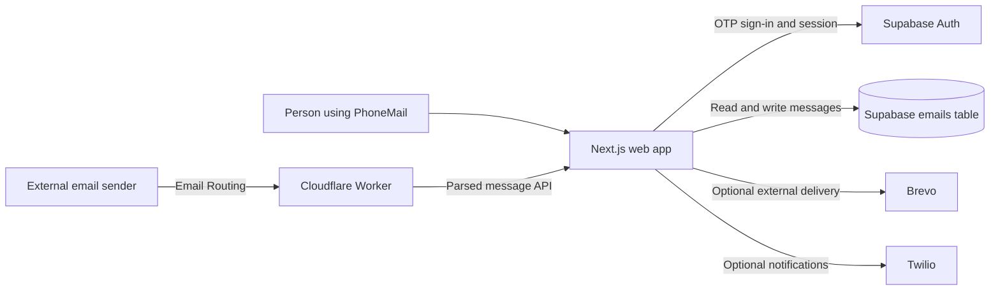

# PhoneMail

PhoneMail is an India-first email prototype that gives each account a mail address derived from its verified phone number. The mobile app centers on the inbox; conversation view is an optional way to read and reply to a thread. Desktop keeps a denser mail layout. The interface has its own visual system rather than copying another mail product.

Example address format: `91XXXXXXXXXX@pmail.vixiya.com` (country code digits, without a leading `+`).

## Product scope

- Language and terms onboarding, then phone-number sign-in and OTP verification through Supabase Auth.
- A responsive inbox with search, folders, favorites, message reading, settings, and compose screens.
- A mobile conversation view for reading and replying to email threads; it is secondary to the inbox.
- Supabase-backed email records and profile metadata, with light and dark themes.
- Integration code for Cloudflare Email Routing, Twilio notifications/IVR, and optional Brevo outbound email.

PhoneMail is a buildathon prototype, not a production-ready public mail service. The app code does not prove that provider accounts, domain DNS, SMS delivery, email routing, or deliverability are configured. See [Integration status and safety](#integration-status-and-safety) for what is implemented and what still needs live verification.

### Hackathon Context: What is live vs. what is intended
Since this was built in just 7 days without a budget for verified domains or paid tiers, the project focuses heavily on the UI, the Database architecture, and the core Next.js application. 
* **What is fully built & working:** The UI, Supabase Auth, Supabase Database read/writes, and the internal application logic.
* **What is coded but pending live infrastructure:** The integration with Cloudflare Email Routing (the Worker code is written!) and Brevo API (the logic exists in `actions.ts`). These are currently set up as graceful fallbacks—the app works beautifully as a prototype while these external providers wait for domain verification and API keys.

## Tech stack

- **Web app:** Next.js 16 App Router, React 19, TypeScript.
- **Authentication and database:** Supabase Auth, Supabase Postgres, and `@supabase/ssr`.
- **Interface:** CSS Modules, Lucide icons, and GSAP for selected transitions.
- **Optional incoming email:** Cloudflare Email Routing Worker with PostalMime.
- **Optional outbound email:** Brevo API.
- **Optional SMS/voice flows:** Twilio SDK and Supabase Auth's configured SMS provider.
- **Local infrastructure:** Docker Compose and a Node.js SMTP receiver.

## Architecture



The app normalizes an Indian 10-digit number to `+91` E.164 format for Supabase phone authentication. After sign-in, the UI derives the PhoneMail address from the authenticated phone number. The inbox reads message rows from Supabase. The compose Server Action authenticates the user, inserts message records under RLS, and checks Brevo's response for external recipients when `BREVO_API_KEY` is configured. A provider response still needs to be checked in the provider account before claiming real-world delivery.

## Integration status and safety

- **Supabase Auth:** the login actions request and verify SMS OTPs through Supabase Auth. The app normalizes local Indian numbers to `+91` before calling Supabase. A configured Supabase test-number mapping can be used for a test login; it does not demonstrate live SMS delivery. Real OTP delivery depends on the Supabase project's Auth/SMS settings and provider limits.
- **Supabase database:** inbox data is stored in `public.emails`. See [`supabase_setup.sql`](supabase_setup.sql) for the current table and RLS setup. Review existing schema and policies before applying it to an existing project.
- **Cloudflare Email Routing:** [`cloudflare-email-worker.js`](cloudflare-email-worker.js) parses inbound mail and signs the exact request body with a timestamped HMAC. `/api/incoming-email` verifies the signature, limits request size, validates the destination, and uses the service-role key only on the server. Install the root Worker dependencies, set the same 32-character-or-longer `PHONEMAIL_WEBHOOK_SECRET` in Wrangler and the web app, set `PHONEMAIL_API_URL`, then create a Cloudflare Email Routing rule for `*@pmail.vixiya.com`. This path has not been deployed or tested against the live domain.
- **Twilio:** the IVR route verifies Twilio signatures using `TWILIO_AUTH_TOKEN` and the public webhook URL. The notification route accepts only an internal bearer token and validated addresses before it can send an SMS. Configure `PHONEMAIL_INTERNAL_API_TOKEN` for both the web app and SMTP container. The app's Supabase Auth SMS provider is separate from these Twilio routes.
- **Brevo:** the compose action saves the message first and checks Brevo's HTTP result. Missing or unconfirmed outbound delivery is reported to the user instead of being shown as success. Configure a verified sender/domain and `BREVO_API_KEY` before claiming that external email works.
- **SMTP demo service:** the separate Node SMTP receiver accepts plaintext SMTP without authentication inside its container, restricts recipients to PhoneMail addresses, limits message size, and returns an SMTP failure when saving fails. Docker maps it only to `127.0.0.1:2525`; do not expose the receiver publicly.

Domain DNS, routing, provider approval, webhook security, rate limits, abuse prevention, and end-to-end delivery have not been proven by a successful local build or test login.

## Run locally

### Requirements

- Node.js 20 or newer and npm for the web app and SMTP demo; use Node.js 22 or newer for the pinned Wrangler CLI.
- A Supabase project with phone authentication enabled and the `public.emails` table configured.
- For real OTP delivery, a working Supabase Auth SMS provider and any current sender/template approvals it requires.

### Environment

Put web-app and SMTP values in `frontend/.env` for Docker or `frontend/.env.local` for local development. The repository contains an empty `frontend/.env` placeholder for evaluation. Configure Cloudflare Worker variables in `wrangler.toml` and Worker secrets with Wrangler. Never commit secret values.

| Variable | Needed for | Notes |
| --- | --- | --- |
| `NEXT_PUBLIC_SUPABASE_URL` | Web app and Docker build | Supabase project URL. |
| `NEXT_PUBLIC_SUPABASE_ANON_KEY` | Web app and Docker build | Public anon key; database access must still be restricted by RLS. |
| `SUPABASE_SERVICE_ROLE_KEY` | Incoming email and SMTP receiver | Privileged secret. Server-side only; never expose it in browser code. |
| `TWILIO_ACCOUNT_SID` | Twilio notification/IVR routes | Server-side secret/configuration. |
| `TWILIO_AUTH_TOKEN` | Twilio notification/IVR routes | Server-side secret; rotate if it has been exposed. |
| `TWILIO_PHONE_NUMBER` | Twilio notifications | Sender number enabled in the Twilio account. |
| `TWILIO_PUBLIC_BASE_URL` | Twilio IVR webhook validation | Public HTTPS origin used to verify the webhook URL behind a proxy; it must match the configured Twilio endpoint. |
| `PHONEMAIL_INTERNAL_API_TOKEN` | Internal SMTP-to-Twilio notification | At least 32 random characters; use the same server-side value in the web app and SMTP service. |
| `PHONEMAIL_WEBHOOK_SECRET` | Cloudflare Worker-to-app incoming mail | At least 32 random characters; use the same secret in the Worker and web app. |
| `BREVO_API_KEY` | Optional external outbound email | Configure a verified sender/domain and confirm delivery at Brevo before claiming it works. |
| `PHONEMAIL_API_URL` | Cloudflare Worker | Public HTTPS base URL of the PhoneMail app. Wrangler config currently points to `https://pmail.vixiya.com`. |
| `PHONEMAIL_DEMO_MODE` | Optional local preview | Set to `true` to show six built-in sample messages without reading or writing email rows. Read-only; never exposed to the browser. |

### Sample inbox preview

To preview the app with six varied sample emails, use a local production build and set the server-only flag in the same PowerShell session. The sample inbox includes an account alert, a two-message conversation, a booking confirmation, a delivery update, and a newsletter-style email. Addresses use reserved example domains; the fixtures are not stored in Supabase, and sending is disabled while preview mode is on.

```powershell
cd frontend
npm run build
$env:PHONEMAIL_DEMO_MODE = 'true'
npm run start -- --hostname 127.0.0.1 --port 3000
```

Open [http://localhost:3000](http://localhost:3000) after signing in. To return to the real inbox, stop the server and clear the flag before starting it again:

```powershell
$env:PHONEMAIL_DEMO_MODE = $null
npm run start -- --hostname 127.0.0.1 --port 3000
```

For local development, Next.js reads the supplied values from `frontend/.env` or `frontend/.env.local`:

```powershell
cd frontend
npm ci
npm run dev
```

Open [http://localhost:3000](http://localhost:3000). To verify a production build locally:

```powershell
cd frontend
npm run build
npm run start
```

For the included Docker setup, fill `frontend/.env` first, then run from the repository root:

```powershell
docker compose --env-file frontend/.env up --build
```

The web container builds and serves the optimized Next.js app on host loopback at `127.0.0.1:3000`. The SMTP service listens on port 25 inside Docker and is available on the host only at `127.0.0.1:2525`; it calls the web container at `http://web:3000`. The SMTP receiver has no client authentication or TLS, so keep this mapping local and do not expose it publicly.

To install and deploy the Cloudflare Email Routing Worker, run from the repository root after configuring the app URL and Worker secret:

```powershell
npm install
npx wrangler secret put PHONEMAIL_WEBHOOK_SECRET
npm run worker:deploy
```

Then create the Email Routing rule in Cloudflare for `*@pmail.vixiya.com` and select the `phonemail-email-routing` Worker. `PHONEMAIL_WEBHOOK_SECRET` must exactly match the web app's server-side value. Worker deployment and live routing require a Cloudflare account/domain setup and are not validated by the local frontend build.

## Supabase database setup

Review [`supabase_setup.sql`](supabase_setup.sql) and run it in the Supabase SQL editor for a fresh or compatible project. It creates/extends the `emails` table, applies RLS policies for the current `@pmail.vixiya.com` address format, and grants authenticated users updates only to `read_status`. It does not configure Supabase Auth's SMS provider or create Twilio/Cloudflare/Brevo credentials.

If your project already has an `emails` table, back it up and compare the existing schema and policies before applying schema changes. Never give the browser the service-role key. The service-role key is intended only for trusted server-side ingestion and bypasses RLS.

## Demo and verification

A low-risk demo can show the onboarding screens, use the Supabase-configured test phone mapping, navigate the inbox, and demonstrate the compose/thread interface. A Supabase test OTP proves the app's test sign-in path; it does **not** prove that a real SMS was delivered.

To claim real email or SMS delivery, verify it with approved test addresses/numbers and confirm the provider reports success. External email requires Brevo credentials and sender verification. Incoming mail requires Cloudflare routing plus a secured Worker-to-app request. `demo_test.py` is an opt-in local SMTP/database check: it requires `PHONEMAIL_RUN_LIVE_DEMO=YES`, `PHONEMAIL_DEMO_RECIPIENT`, `NEXT_PUBLIC_SUPABASE_URL`, and `SUPABASE_SERVICE_ROLE_KEY`. It does not send public internet email; if SMTP notifications are configured, it may send a real SMS, so use only a controlled test recipient.

Checks completed during this submission pass:

- `cd frontend && npm run lint` — passed with no warnings.
- `cd frontend && npm run build` — optimized production build and TypeScript checks passed without downloading fonts.
- Production-mode HTTP smoke check — `/login` returned 200 with the security headers; unauthenticated requests to the incoming-mail and Twilio-notification endpoints returned 401.
- `node --check` — Cloudflare Worker, SMTP receiver, and domain migration script syntax passed.

The Cloudflare Worker was not installed or deployed, Docker Compose was not run, and no real OTP, incoming email, Brevo delivery, or Twilio SMS was sent. Verify those with the configured provider accounts before describing them as live.

## Submission checklist

- Keep this README with the stack, architecture, setup steps, and honest integration status.
- Publish the GitHub repository and make it public as required by the form.
- Push the final commit to the repository's `main` branch before the deadline.
- Commit only the empty `frontend/.env` placeholder; never commit real environment values. Upload the filled environment/key files through the submission form only.
- Put separately uploaded auth keys in a text file, one per line, using the form's format, for example: `frontend/.env SUPABASE_SERVICE_ROLE_KEY = "<value>"`. Do not include the value in this repository or in chat.
- If you record the optional demo, show the product flow at readable 1080p and state which provider paths are simulated, test-only, or live.
