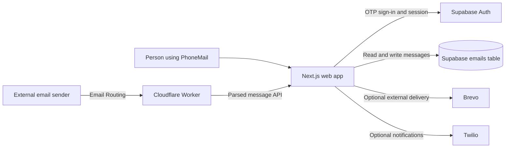

# PhoneMail

PhoneMail is an India-first email prototype that gives each account a mail address derived from its verified phone number. The mobile app centers on the inbox; conversation view is an optional way to read and reply to a thread. Desktop keeps a denser mail layout. The interface has its own visual system rather than copying another mail product.

Example address: `919279581387@pmail.vixiya.com` (country code digits, without a leading `+`).

## Product scope

- Language and terms onboarding, then phone-number sign-in and OTP verification through Supabase Auth.
- A responsive inbox with search, folders, favorites, message reading, settings, and compose screens.
- A mobile conversation view for reading and replying to email threads; it is secondary to the inbox.
- Supabase-backed email records and profile metadata, with light and dark themes.
- Integration code for Cloudflare Email Routing, Twilio notifications/IVR, and optional Brevo outbound email.

PhoneMail is a buildathon prototype, not a production-ready public mail service. The app code does not prove that provider accounts, domain DNS, SMS delivery, email routing, or deliverability are configured. Several webhook paths also need authentication and stronger validation before they are safe to expose publicly; see [Integration status and safety](#integration-status-and-safety).

## Tech stack

- **Web app:** Next.js 16 App Router, React 19, TypeScript.
- **Authentication and database:** Supabase Auth, Supabase Postgres, and `@supabase/ssr`.
- **Interface:** CSS Modules, Lucide icons, and GSAP for selected transitions.
- **Optional incoming email:** Cloudflare Email Routing Worker with PostalMime.
- **Optional outbound email:** Brevo API.
- **Optional SMS/voice flows:** Twilio SDK and Supabase Auth's configured SMS provider.
- **Local infrastructure:** Docker Compose and a Node.js SMTP receiver.

## Architecture



The app normalizes an Indian 10-digit number to `+91` E.164 format for Supabase phone authentication. After sign-in, the UI derives the PhoneMail address from the authenticated phone number. The inbox reads message rows from Supabase. The compose Server Action inserts message records and can call Brevo for external recipients when `BREVO_API_KEY` is configured. A present API key alone does not confirm delivery: provider response handling and failed database writes need stronger handling before relying on this path.

## Integration status and safety

- **Supabase Auth:** the login actions request and verify SMS OTPs through Supabase Auth. The app normalizes local Indian numbers to `+91` before calling Supabase. A configured Supabase test-number mapping can be used for a test login; it does not demonstrate live SMS delivery. Real OTP delivery depends on the Supabase project's Auth/SMS settings and provider limits.
- **Supabase database:** inbox data is stored in `public.emails`. See [`supabase_setup.sql`](supabase_setup.sql) for the current table and RLS setup. Review existing schema and policies before applying it to an existing project.
- **Cloudflare Email Routing:** the Worker parses inbound mail and posts to `/api/incoming-email`. That API currently uses the Supabase service-role key and does not authenticate the Worker request or sufficiently validate/rate-limit its payload. Do not expose it as a public mail-ingest endpoint until those protections are implemented.
- **Twilio:** notification and IVR routes are present. They do not currently verify Twilio request signatures; protect them before exposing them publicly. The app's Supabase Auth SMS provider is configured separately from the Twilio variables used by these routes.
- **Brevo:** the compose action attempts external delivery when `BREVO_API_KEY` is set. Configure and verify the sender/domain with Brevo, and check delivery at the provider. The current action does not robustly handle provider HTTP failures.
- **SMTP demo service:** the separate Node SMTP receiver accepts unauthenticated plaintext SMTP and may trigger Twilio notifications. Keep it local or on a controlled network; it is not hardened for public mail-server use.

Domain DNS, routing, provider approval, webhook security, rate limits, abuse prevention, and end-to-end delivery have not been proven by a successful local build or test login.

## Run locally

### Requirements

- Node.js 20 or newer and npm.
- A Supabase project with phone authentication enabled and the `public.emails` table configured.
- For real OTP delivery, a working Supabase Auth SMS provider and any current sender/template approvals it requires.

### Environment

Put secrets in `frontend/.env` for this setup. The repository contains an empty placeholder at that path; supply real values locally or use the separate environment file provided for evaluation. Never commit secret values.

| Variable | Needed for | Notes |
| --- | --- | --- |
| `NEXT_PUBLIC_SUPABASE_URL` | Web app and Docker build | Supabase project URL. |
| `NEXT_PUBLIC_SUPABASE_ANON_KEY` | Web app and Docker build | Public anon key; database access must still be restricted by RLS. |
| `SUPABASE_SERVICE_ROLE_KEY` | Incoming email and SMTP receiver | Privileged secret. Server-side only; never expose it in browser code. |
| `TWILIO_ACCOUNT_SID` | Twilio notification/IVR routes | Server-side secret/configuration. |
| `TWILIO_AUTH_TOKEN` | Twilio notification/IVR routes | Server-side secret; rotate if it has been exposed. |
| `TWILIO_PHONE_NUMBER` | Twilio notification/IVR routes | Sender number enabled in the Twilio account. |
| `BREVO_API_KEY` | Optional external outbound email | The current compose action only attempts Brevo delivery when this is set. Verify sender/domain approval and provider response. |
| `PHONEMAIL_API_URL` | Optional Cloudflare Worker | Base URL of the deployed PhoneMail app. |

For local development, Next.js reads the supplied values from `frontend/.env` or `frontend/.env.local`:

```powershell
cd frontend
npm ci
npm run dev
```

Open [http://localhost:3000](http://localhost:3000). To verify a production build locally:

```powershell
cd frontend
npm run build
npm run start
```

For the included Docker setup, fill `frontend/.env` first, then run from the repository root:

```powershell
docker compose --env-file frontend/.env up --build
```

The web container builds and serves the optimized Next.js app. The SMTP container listens on port 25 and is configured to reach the web container at `http://web:3000`. The SMTP receiver accepts unauthenticated plaintext SMTP; do not expose it directly to the public internet without authentication, TLS, relay protections, and abuse controls.

## Supabase database setup

Review [`supabase_setup.sql`](supabase_setup.sql) and run it in the Supabase SQL editor for a fresh or compatible project. It creates/extends the `emails` table and applies RLS policies for the current `@pmail.vixiya.com` address format. It does not configure Supabase Auth's SMS provider or create Twilio/Cloudflare/Brevo credentials.

If your project already has an `emails` table, back it up and compare the existing schema and policies before applying schema changes. Never give the browser the service-role key. The service-role key is intended only for trusted server-side ingestion and bypasses RLS.

## Demo and verification

A low-risk demo can show the onboarding screens, use the Supabase-configured test phone mapping, navigate the inbox, and demonstrate the compose/thread interface. A Supabase test OTP proves the app's test sign-in path; it does **not** prove that a real SMS was delivered.

To claim real email or SMS delivery, verify it with approved test addresses/numbers and confirm the provider reports success. External email requires Brevo credentials and sender verification. Incoming mail requires Cloudflare routing plus a secured Worker-to-app request. `demo_test.py` is an opt-in live integration helper: it requires `PHONEMAIL_RUN_LIVE_DEMO=YES`, `PHONEMAIL_DEMO_RECIPIENT`, `NEXT_PUBLIC_SUPABASE_URL`, and `SUPABASE_SERVICE_ROLE_KEY`. It sends a real email and may trigger an SMS notification, so use only a controlled test recipient.

Checks completed during submission preparation:

- `cd frontend && npm run build` — production compilation and TypeScript checks; passed after the latest UI changes.
- Targeted ESLint on the inbox, desktop client, login, and toast components.
- Local `/login` HTTP smoke check returned HTTP 200 after the latest UI changes.

These checks do not validate a real OTP send, inbound routing, external email delivery, or Twilio SMS.

## Submission checklist

- Keep this README with the stack, architecture, setup steps, and honest integration status.
- Publish the GitHub repository and make it public as required by the form.
- Push the final commit to the repository's `main` branch before the deadline.
- Commit only the empty `frontend/.env` placeholder; never commit real environment values. Upload the filled environment/key files through the submission form only.
- Put separately uploaded auth keys in a text file, one per line, using the form's format, for example: `frontend/.env SUPABASE_SERVICE_ROLE_KEY = "<value>"`. Do not include the value in this repository or in chat.
- If you record the optional demo, show the product flow at readable 1080p and state which provider paths are simulated, test-only, or live.
