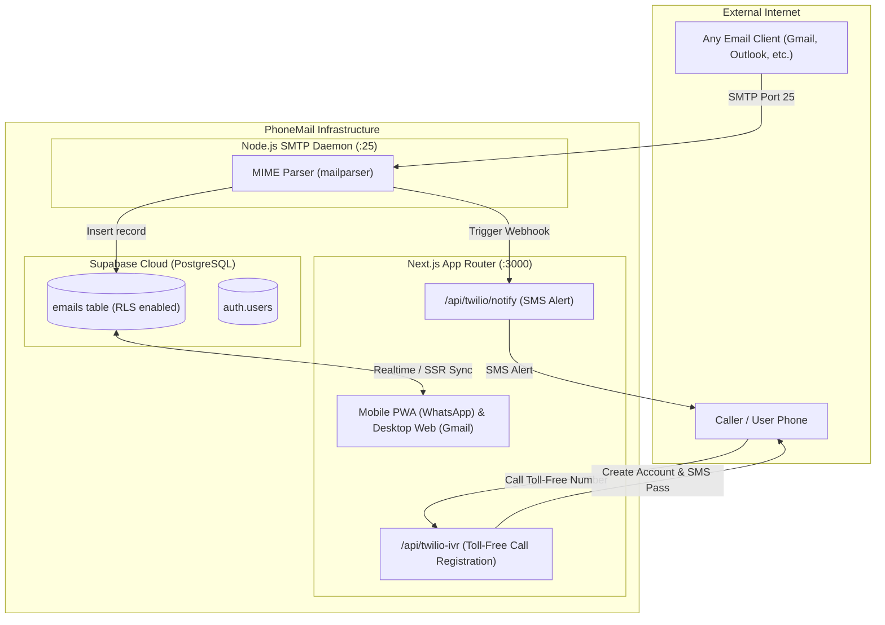

# 📱 PhoneMail

> **Universal Email Using Phone Numbers as IDs**  
> Built for the **AlphaStack 7-Day Buildathon**

PhoneMail bridges the gap between universal email accessibility and the speed of modern instant messaging. Every user gets a universal email ID mapped directly to their phone number (e.g. `+15550192834@phonemail.com`).

---

## 🌟 Key Experiences

### 1. Mobile Client: WhatsApp Design Language + Spike Mail UX
- **Authentic WhatsApp Aesthetics**: Dark slate surfaces (`#111b21`), emerald accents (`#00a884`), custom doodle chat wallpaper, speech tails, read double ticks (`✓✓`), and fluid GSAP transitions.
- **4-Step Mobile Onboarding**:
  1. *Language Selection*: Multi-language chooser (English, Español, हिन्दी, etc.).
  2. *Terms & Privacy*: WhatsApp-style welcome screen with legal consent.
  3. *SIM Detection*: Simulated SIM auto-fill for phone number verification.
  4. *SMS Auto-Detection*: Automated 6-digit code detection and inbox launch.
- **Spike Mail Chat Features**:
  - *Compact Subject*: Displays above input box on new threads, automatically hides on replies.
  - *Swipe-to-Reply*: Swipe right on any bubble to quote the original email.
  - *Tap to Expand*: Tap any message to open the **Traditional Email View** with full headers (`From`, `To`, `Date`, `Subject`, `HTML`).
  - *Traditional Compose Toggle*: Switch to full traditional email compose directly from WhatsApp's camera button slot.
- **Drawer & Alias Management**:
  - Slide-out navigation drawer (*Home Unified Inbox, Starred, Drafts, Spam, Trash*).
  - Profile Modal with **Alias ID Management** (e.g. `work@phonemail.com`).

### 2. Desktop Web Client: Google Workspace / Gmail 3-Pane UX
- **Gmail Layout**: Collapsible left sidebar with floating **Compose** pill button (`#c2e7ff`), folder badges, and alias indicators.
- **Dense Inbox**: Checkbox selection, star toggling, snippet preview, and hover actions.
- **Desktop Login**: Google-style single-screen card with phone number, OTP, and hyperlinked Terms of Service.

---

## 🏗️ Architecture



---

## ⚡ Quick Start

### Option 1: Docker Compose (1-Command Startup)

```bash
docker compose --env-file frontend/.env.local up -d --build
```
- **Web Client**: [http://localhost:3000](http://localhost:3000)
- **SMTP Daemon**: Listening on `0.0.0.0:25`

### Option 2: Local Development

1. **Frontend**:
   ```bash
   cd frontend
   npm install
   npm run dev
   ```
2. **SMTP Microservice**:
   ```bash
   cd smtp-server
   npm install
   npm start
   ```

---

## 🧪 Live Demo Runner (For Evaluators & Judges)

Run the included automated verification script to test the complete pipeline:

```bash
python demo_test.py
```

This script:
1. Connects to `localhost:25` and transmits a genuine RFC-822 email.
2. Verifies MIME parsing and Supabase insertion in PostgreSQL.
3. Tests the Twilio SMS notification webhook.
4. Allows judges to see the email pop up live inside the WhatsApp chat thread!

---

## 📱 Generating the Android APK

PhoneMail is configured as a **Progressive Web App (PWA)** with 192x192 & 512x512 maskable icons, `manifest.json`, and offline service worker (`sw.js`).

### Instant APK via PWABuilder:
1. Expose your frontend or host it: `ngrok http 3000`
2. Go to [PWABuilder.com](https://www.pwabuilder.com/)
3. Enter your URL $\rightarrow$ Click **Package for Android** $\rightarrow$ **Download APK**.

### Local APK via Bubblewrap CLI:
```bash
npm i -g @bubblewrap/cli
bubblewrap init --manifest=https://your-url/manifest.json
bubblewrap build
```

---

## 🔒 Security & Database Model

- **Row Level Security (RLS)**: Enforced in PostgreSQL via `auth.jwt()`. Users can only select, update, and delete emails where their authenticated phone number matches `sender_address` or `recipient_address`.
- **Zero Cost Architecture**: Uses Supabase Free Tier, Twilio Free Trial, and local Node.js SMTP.
